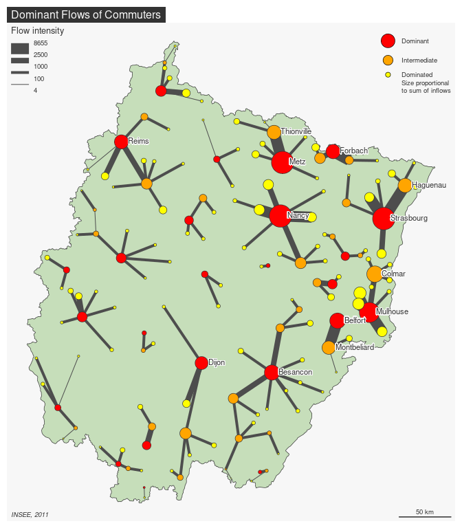

# `flows`: Flow Selection and Analysis 

<!-- badges: start -->
[](https://github.com/riatelab/flows/actions/workflows/R-CMD-check.yaml)
<!-- badges: end -->

`flows` allows to select, analyse and visualise flows. Its main
functionalities are: flows selection (main, dominant or major flows),
indicators production about selected flows and lost information,
representation of dominant flows (map and graph).

## Installation

You can install the development version of flows from GitHub with:

``` r
remotes::install_github("riatelab/flows")
```

## Usage

Example of a dominant flows analysis on commuters data:

``` r
library(sf)
library(flows)
library(mapsf)
# Import datasets
nav <- read.csv(system.file("csv/nav.csv", package = "flows"))
# Trnasform to wide
mat <- prepare_mat(x = nav, i = "i", j = "j", fij = "fij")
# import spatial objects
UA <- st_read(system.file("gpkg/GE.gpkg", package = "flows"), 
              layer = "urban_area", quiet = TRUE)
GE <- st_read(system.file("gpkg/GE.gpkg", package = "flows"), 
              layer = "region", quiet = TRUE)
# Map
mf_map(GE, col = "#c6deba")
out <- map_nodal_flows(mat = mat, x = UA,
                       inches = .17,
                       col_node = c('red', 'orange', 'yellow'),
                       col_flow = "grey30",
                       breaks = c(4,100,1000,2500,8655),
                       lwd = c(1,4,8,16), add = TRUE)
mf_label(out$nodes[out$nodes$w>6000,], var = 'name',
         halo = TRUE, overlap = FALSE, pos = 4)
mf_title("Dominant Flows of Commuters")
mf_credits("INSEE, 2011")
mf_scale(50)
```

<!-- -->

## Ressources

- [Beauguitte, L., Giraud, T. et Guérois, M. (2015). Un outil pour la
  sélection et la visualisation de flux : le package flows. Netcom,
  29(3/4), 399-408.](https://netcom.revues.org/2134) <small>(This paper
  is in French and refers to previous versions of the package.)</small>
- Package vignette

## Community Guidelines

One can contribute to the package through [pull
requests](https://github.com/riatelab/flows/pulls) and report issues or
ask questions [here](https://github.com/riatelab/flows/issues).
