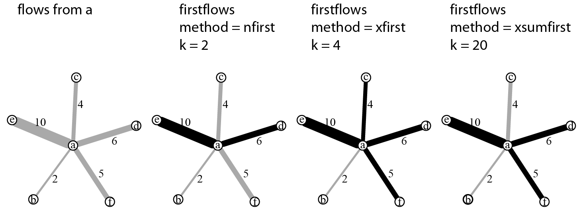
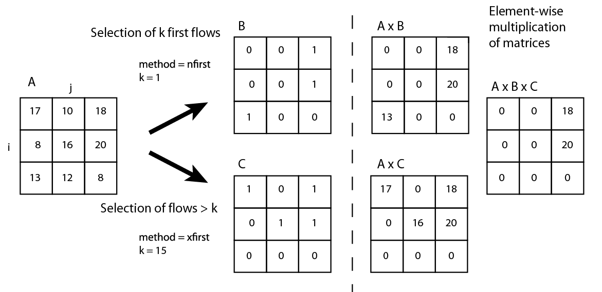

#Introduction

The **flows** package contains functions that select flows, provide statistics on selections and propose map and graph visualisations.    
The first part of the vignette reminds several methods of flow selection, the second part presents the main functions of the package and the last one proposes an exemple of analysis based on commuters data in the French Grand Est region.  

#Analysis of geographic flows: issues and methods

In the field of spatial analysis, working on flows supposes to focus on the relationships between places rather than on their characteristics. Analysis and flow representation often assume a selection to ease the interpretation. 

One of the first method developed was the so-called dominant flows (or nodal regions) proposed by Nystuen and Dacey in 1961 (@nystuen). Working on telephone flows between cities in the Seattle area, they sought to highlight hierarchy between locations. According to this method, a place _i_ is dominated by a place _j_ if two conditions are met:

1. the most important flow from _i_ is emitted towards _j_;

2. the sum of the flows received by _j_ is greater than the sum of the flows received by _i_.

This method creates what is called in graph theory a tree (acyclic graph) or a forest (a set of unconnected trees) with three types of nodes: dominant, dominated and intermediate. If the method creates a clear functional hierarchy, its major drawback is to undervalue flows intensities.

Various methods have subsequently been proposed to better reflect this intensity, one of the most frequently used being the so-called major flows: it selects only the most important flows, absolute or relative, either locally or globally. Analysing commuters data between cities, one may choose to select:

* all flows greater than 100;

* the 50 first flows (global criterion);

* the 10 first flows emitted by each city (local criterion).

These criteria can also be expressed in relative form:

* flows that represent more than 10% of the active population of each city (local criterion);

* flows that take into account 80% of all commuters (global criterion).

These methods often highlight hierarchies between places but the loss of information created by the selection is rarely questioned. So it seems useful to propose statistical indicators to assess the volume of lost information and characteristics of the selected flows.

#The package flows

A typical data workflow may be:

1. data preparation;

2. flow selection;

3. statistical data and graphical outputs on the selection made;

4. graph or map representation (dominant flows).

##Data Preparation
Flow data can be found in wide (matrix) or long format (_i-j-fij_, i.e. origin - destination - flow intensity).
As all **flows** function take flow data in wide format, the `preflows` function transforms a link list into a square matrix. `preflows` has four arguments: a data.frame to transform (`mat`), the origin (`i`), the destination (`j`) and the flow intensity (`fij`).

```{r}
library(flows)
# Import data
data(nav)
head(nav)
# Prepare data
myflows <- prepflows(mat = nav, i = "i", j = "j", fij = "fij")
myflows[1:4,1:4]
```


##Flow Selection
Three selection methods based on the flow origins are accessible through the `firstflows` function:

* `nfirst`: the `k` first flows from all origins;

* `xfirst`: all flows greater than a threshold `k`;

* `xsumfirst`: as many flows as necessary for each origin so that their sum is at least equal to `k`.


Figure 1: The three methods of the `firstflows` function
   
**Black links are the selected ones.**


Methods taking into account the total volume of flows are implemented in the `firstflowsg` function. They are identical to the ones described above: selection of the `k` first flows, selection of flows greater than `k` and  selection of flows such as the sum is at least equal to `k`.


The `domflows` function selects flows based on a dominance test. This function may be used to select flows obeying the second criterion of Nystuen and Dacey method.


All these functions take as input a square matrix of flows and generate binary matrices of the same size. Selected flows are coded 1, others 0. It is therefore possible to combine criteria of selection through element-wise multiplication of matrices (Figure 2).

Figure 2: Flow selection and criteria combination
 

The `statmat` function provides various indicators and graphical outputs on a flow matrix to allow statistically relevant selections. Measures provided are density (number of present flows divided by the number of possible flows); number, size and composition of connected components; sum, quartiles and average intensity of flows. In addition, four graphics can be plotted: degree distribution curve (by default, outdegree), weighted degree distribution curve, Lorenz curve and boxplot on flow intensities.

```{r, fig.width=5, fig.height=5}
# Import data
data(nav)
myflows <- prepflows(mat = nav, i = "i", j = "j", fij = "fij")

# Get statistics about the matrix
statmat(mat = myflows, output = "none", verbose = TRUE)

# Plot Lorenz curve only
statmat(mat = myflows, output = "lorenz", verbose = FALSE)
```

```{r, fig.width=7, fig.height=7}
# Graphics only
statmat(mat = myflows, output = "all", verbose = FALSE)

# Statistics only
mystats <- statmat(mat = myflows, output = "none", verbose = FALSE)
str(mystats)
# Sum of flows
mystats$sumflows

```

To ease comparisons, the `compmat` function outputs a data.frame that provides statistics on differences between two matrices (for example a matrix and selection of this matrix).

Visualisation helps analysis, `plotDomFlows` function produces a graph where sizes and colors of vertices depend on their position in the graph (dominant, intermediate or dominated) and thicknesses of links depend on flow intensites.    
  
The `plotMapDomFlows` function maps the selected flows according to the same principles.    
Both functions only apply to a dominant flows selection[^1].

# Commuters flows in the French Grand Est

As an illustration, we present a brief analysis of commuter flows between urban areas of the Grand Est region in France[^2]. 

We compare two different thresholds (500 and 1000) on the total volume of flows.

```{r, fig.height = 4, fig.width=4}
# Import data
data(nav)
myflows <- prepflows(mat = nav, i = "i", j = "j", fij = "fij")

# Remove the matrix diagonal
diag(myflows) <- 0

# Selection of flows > 500
flowSel1 <- firstflowsg(mat = myflows, method = "xfirst", k = 500)
# Selection of flows > 1000
flowSel2 <- firstflowsg(mat = myflows, method = "xfirst", k = 1000)

# Compare initial matrix and selected matrices
compmat(mat1 = myflows, mat2 = myflows * flowSel1, digits = 1)
compmat(mat1 = myflows, mat2 = myflows * flowSel2, digits = 1)
```

If we select flows greater than 500 commuters, we loose 95.7% of all links but only 38% of the volume of flows. With a threshold of 1000 commuters, 98% of links are lost but only 53% of the volume of flows.

The following exemple selects flows that represent at least 20% of the sum of outgoing flows for each urban area.

```{r, fig.height = 6, fig.width=6}
# Import data
data(nav)
myflows <- prepflows(mat = nav, i = "i", j = "j", fij = "fij")

# Remove the matrix diagonal
diag(myflows) <- 0

# Percentage of each outgoing flows
myflows2 <- myflows / rowSums(myflows) * 100

# Select flows that represent at least 20% of the sum of outgoing flows for 
# each urban area.
flowSel <- firstflows(mat = myflows2, method = "xfirst", k = 20)

# Compare initial and selected matrices
compmat(mat1 = myflows,mat2 = flowSel * myflows)

```

This selection keeps only 7% of all links and 53% of the volume of flows. 

We decide to use this selection as first criteria of our analysis. The second one will be a dominant flow selection based on the sum of incoming flows.

```{r, fig.height=7, fig.width=7, eval = TRUE}
# Import data
data(nav)
myflows <- prepflows(mat = nav, i = "i", j = "j", fij = "fij")

# Remove the matrix diagonal
diag(myflows) <- 0

# Select flows that represent at least 20% of the sum of outgoing flows for 
# each urban area.
flowSel1 <- firstflows(mat = myflows/rowSums(myflows)*100, method = "xfirst", 
                       k = 20)


# Select the dominant flows (incoming flows criterion)
flowSel2 <- domflows(mat = myflows, w = colSums(myflows), k = 1)

# Combine selections
flowSel <- myflows * flowSel1 * flowSel2

# Node weights
inflows <- data.frame(id = colnames(myflows), w = colSums(myflows))

# Plot dominant flows map
opar <- par(mar = c(0,0,2,0))
sp::plot(GE, col = "#cceae7", border = NA)
plotMapDomFlows(mat = flowSel, spdf = UA, spdfid = "ID", w = inflows, wid = "id",
                wvar = "w", wcex = 0.05, add = TRUE,
                legend.flows.pos = "topright",
                legend.flows.title = "Nb. of commuters")
title("Dominant Flows of Commuters")
mtext(text = "INSEE, 2011", side = 4, line = -1, adj = 0.01, cex = 0.8)
par(opar)


# Statistics on major urban areas
inflows <- data.frame(id = colnames(myflows), w = colSums(myflows))
UA.df <- unique(data.frame(id = c(nav$i, nav$j),name = c(nav$namei, nav$namej)))
UAindegreew <- merge(inflows, UA.df, by = "id", all.x = TRUE)
UAindegreew[order(UAindegreew$w, decreasing = TRUE),][1:10,]

```


The top of the node hierarchy brings out clearly, in descending order, the domination of Nancy, Strasbourg, Metz and Mulhouse, each attracting more than 10 000 commuters.

One could easily repeat these selections, with higher or smaller thresholds, to identify the most robust connections and the intermittent ones.

# Conclusion

The **flows** package aims to enable a relevant selection of flows, while leaving maximum flexibility to the user. 

# References


---
references:
- id: nystuen
  title: A Graph Theory Interpretation of Nodal Regions
  author:
  - family: Nystuen
    given: J.
  author:
  - family: Dacey
    given: M.
  container-title: Papers and Proceedings of the Regional Science Association
  volume: 7
  page: 29-42
  type: article-journal
  issued:
    year: 1961
---

[^1]: Viewing options are only dedicated to the nodal regions / dominant flows method since other R packages exist to ensure graph or map representations.

[^2]: Data comes from the 2011 French National Census (*Recensement Général de la Population de l'INSEE*). The area includes five administrative regions: Champagne-Ardenne, Lorraine, Alsace, Bourgogne, and Franche-Comté. Cities are urban areas (2010 borders).


